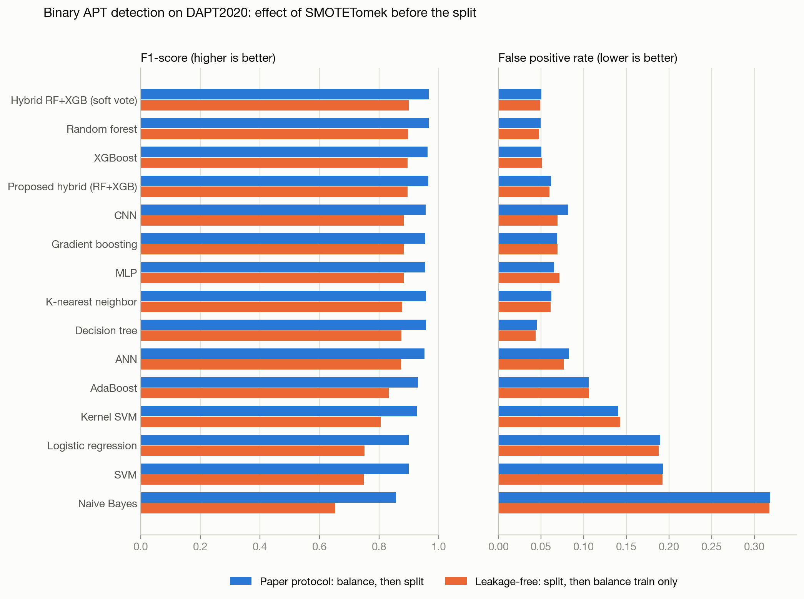
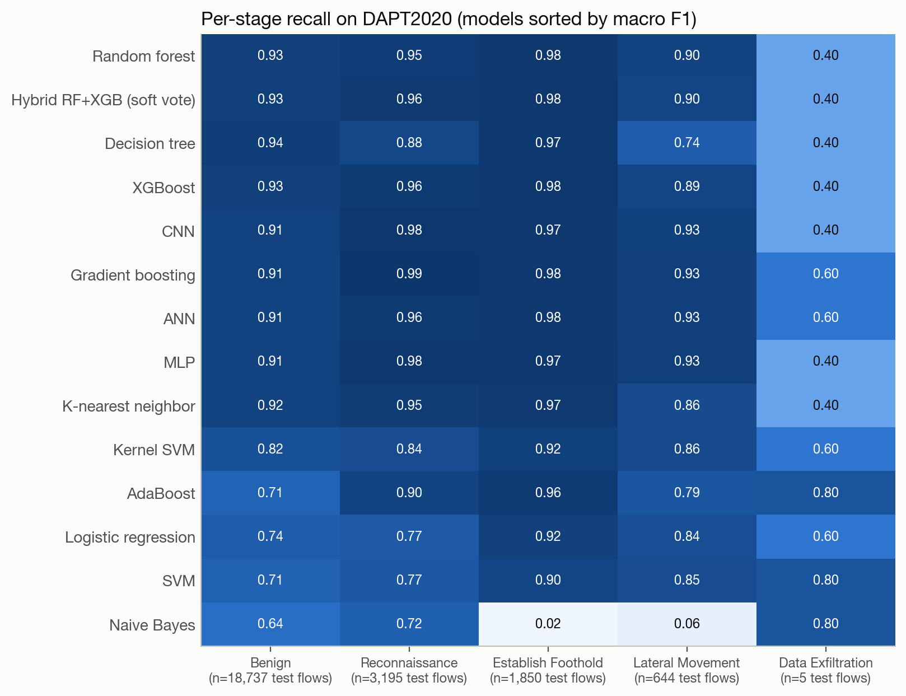

# APT Detection with a Hybrid Ensemble (RF + XGBoost) on DAPT2020

Implementation of **Saini N., Bhat Kasaragod V., Prakasha K., Das A.K. (2023). _A hybrid ensemble
machine learning model for detecting APT attacks based on network behavior anomaly detection._
Concurrency and Computation: Practice and Experience 35(28):e7865.**
[doi:10.1002/cpe.7865](https://doi.org/10.1002/cpe.7865), re-run on an **APT-specific dataset**.

## 1. Why the dataset was changed

The paper claims to detect *Advanced Persistent Threats*, but evaluates on CSE-CIC-IDS2018,
CIC-IDS2017, NSL-KDD and UNSW-NB15. These are **generic intrusion-detection datasets**: their
attacks are mostly DoS/DDoS, brute force, botnets and web attacks, recorded as isolated events.
None of them is organised around the multi-stage, low-and-slow behaviour that defines an APT.

This project uses **DAPT2020** instead:

| | |
|---|---|
| Paper | Myneni S. et al., *DAPT 2020 – Constructing a Benchmark Dataset for Advanced Persistent Threats*, in *Deployable Machine Learning for Security Defense* (MLHat 2020), Springer CCIS ([doi:10.1007/978-3-030-59621-7_8](https://doi.org/10.1007/978-3-030-59621-7_8)) |
| Source | https://www.kaggle.com/datasets/sowmyamyneni/dapt2020 (published by the dataset's author) |
| What it is | 5 days of traffic from a public web server and a private network, with a red team running a full APT campaign |
| Labels | Every flow has an **Activity** (e.g., Network Scan, SQL Injection, Backdoor, Privilege Escalation) and an **APT Stage**: Benign, Reconnaissance, Establish Foothold, Lateral Movement, Data Exfiltration |
| Features | 76 CICFlowMeter flow features, **the same feature family as CIC-IDS2017/CSE-CIC-IDS2018**, so the paper's pipeline applies unchanged |
| Size used | 86,691 labelled flows (the 10 `*.pcap_Flow.csv` files, ~45 MB; the 9.7 GB rest is raw PCAPs and logs) |

Because DAPT2020 uses the same features as the paper's main datasets, results can be compared
directly, and its stage labels allow an extra experiment the paper could not run: identifying
*which APT stage* a flow belongs to.

Alternatives that were considered: SCVIC-APT-2021 (paywalled on IEEE DataPort), Unraveled (2023,
semi-synthetic, 835 MB) and CICAPT-IIoT (2024, Industrial IoT). DAPT2020 is the most widely used
APT network benchmark and the closest fit to the paper's setup.

### Data issues found and handled

* `enp0s3-pvt-thursday.pcap_Flow.csv` has **no header row**. A plain `pd.read_csv` treats its
  first flow as the header and loses 2,314 of the 2,451 Lateral Movement flows.
  `src/data_loader.py` detects this. With it fixed, the benign count is 63,712, which matches the
  count reported for DAPT2020.
* Benign labels are spelled inconsistently (`BENIGN`, `Benign`, `Normal`); they are normalised.
* 12 constant columns and 5,257 duplicate flows are removed (paper Section 3.2).
* Possible label noise: on the Tuesday reconnaissance capture, 4,432 flows labelled `BENIGN`
  involve the external attacker host. See the error analysis below.

## 2. What was implemented (faithful to the paper)

Every step below comes from the paper (Sections 3.2–3.3, Algorithm 1, Table 7):

| Step | Paper | This implementation |
|---|---|---|
| Drop identifiers | Timestamp, Flow ID, Src IP, Dst IP, Src Port | same |
| Cleaning | remove NaN/inf, constant features, duplicates; dummy variables | same (Protocol one-hot encoded) |
| Target | Normal = 0, all attacks aggregated into one anomaly class = 1 | same (Benign = 0, any APT stage = 1) |
| Balancing | SMOTETomek | `imblearn` SMOTETomek |
| Split | 70:30 (their Fig. 11 test set of 15,583 rows = 30%) | 70:30, stratified |
| Feature selection | Pearson filter at 0.90, then mutual information top-30 | same (fitted on training data) |
| Hybrid model | `combo.SimpleClassifierAggregator([RandomForestClassifier(), XGBClassifier()], method='average')` | exact re-implementation (see below) |
| Hyperparameters | 100 trees, learning rate 1.0, max depth 4 | same |
| Baselines | KNN, DT, SVM, RF, XGBoost, GB, Kernel SVM, AdaBoost, NB, LR, CNN, ANN, MLP | all 13 |
| Metrics | Accuracy, Precision, Recall, F1, TNR, FPR, FNR, AUC | all 8 |

**How the paper's hybrid actually combines its models.** Reading the `combo` library source shows
that `SimpleClassifierAggregator.predict()` averages the two models' *predicted labels* and
predicts 1 when the average is `>= 0.5`. With two binary models, **a flow is flagged as APT if
either Random Forest or XGBoost flags it** (an OR rule), which raises recall at the cost of more
false positives. `HybridRFXGB(vote="combo")` reproduces this exactly. A soft-voting variant
(average of probabilities, `vote="soft"`) is also reported, because the OR rule is undefined for
the multi-class stage experiment.

### Deviations and assumptions (documented, not hidden)

1. **Paper inconsistency:** the text says 70:30 but Algorithm 1 says 80:20. The paper's own
   confusion matrix (15,583 test rows out of 51,942) shows 70:30 was used, so 70:30 is used here.
2. **Baseline hyperparameters** are not given in the paper; library defaults are used. RF and
   XGBoost use the hybrid's settings so the hybrid is compared against its own components.
3. **Kernel SVM** (RBF) is trained on a stratified 20,000-row subsample; RBF SVM training grows
   quadratically with the number of rows.
4. **CNN/ANN/MLP** architectures are not described in the paper. Standard architectures are used
   (`src/deep_models.py`), trained for up to 200 epochs (as in the paper) with early stopping on a
   validation split. They train on the GPU when available (Apple Silicon MPS here, or CUDA). GPU
   kernels are not bit-for-bit deterministic, so CNN/ANN/MLP numbers can move slightly between runs;
   the classical models reproduce exactly.
5. **AUC** is computed from predicted probabilities. The paper's ROC curves have a single corner,
   meaning they were drawn from hard 0/1 predictions; that "AUC" equals balanced accuracy.

## 3. A methodological problem in the paper, and the fix

The paper applies SMOTETomek to the **whole dataset before splitting** ("After converting it into
balanced dataset, the dataset has been divided into two parts"). Consequences:

* the test set contains **synthetic SMOTE flows**, interpolated from real flows that may sit in the
  training set, so information leaks from training into testing;
* the test set is artificially 50/50 balanced, which inflates precision and F1 compared with real
  traffic, where benign flows dominate.

Both protocols are therefore run, with everything else identical:

* **Paper protocol:** clean → SMOTETomek on all data → 70:30 split → feature selection → train/test.
* **Leakage-free protocol:** clean → 70:30 split → SMOTETomek on the **training set only** →
  feature selection → train/test on untouched real flows.

## 4. Results

Full tables for all 15 models are in [results/summary.md](results/summary.md); figures are in
[results/figures/](results/figures/). All numbers are on DAPT2020 (test set = 30% of flows).

### 4.1 Binary detection (Benign vs APT): the paper's experiment

| Proposed hybrid (RF+XGB) | Accuracy | Precision | Recall | F1 | FPR | AUC |
|---|---|---|---|---|---|---|
| Paper, CSE-CIC-IDS2018 (their Table 7) | 98.92 | 99.47 | 98.35 | 98.90 | 0.52 | 98.91* |
| **This work, DAPT2020, paper protocol** | 96.43 | 94.04 | 99.06 | 96.49 | 6.14 | 99.51 |
| **This work, DAPT2020, leakage-free** | 94.68 | 83.10 | 96.87 | 89.46 | 5.99 | 99.09 |

\* the paper's AUC is computed from hard predictions (see Deviations, item 5).

Best models under the leakage-free protocol (single run, seed 42):

| Model | Accuracy | Precision | Recall | F1 | FPR | AUC |
|---|---|---|---|---|---|---|
| Hybrid RF+XGB (soft vote) | **95.00** | 85.47 | 94.64 | **89.82** | 4.89 | **99.09** |
| Random forest | 94.93 | **85.69** | 93.94 | 89.63 | **4.77** | 98.93 |
| XGBoost | 94.85 | 85.02 | 94.56 | 89.53 | 5.06 | 98.99 |
| **Proposed hybrid (RF+XGB)** | 94.68 | 83.10 | 96.87 | 89.46 | 5.99 | **99.09** |
| CNN | 93.98 | 80.95 | 97.00 | 88.25 | 6.94 | 98.91 |
| MLP | 93.90 | 80.55 | 97.33 | 88.15 | 7.14 | 98.86 |
| Naive Bayes (worst) | 75.40 | 48.64 | 99.03 | 65.24 | 31.78 | 88.19 |

**Robustness over 5 random seeds** (leakage-free; mean ± std; [details](results/binary_leakage_free/seed_robustness.md)):

| Model | F1 | Recall | FPR | AUC |
|---|---|---|---|---|
| Proposed hybrid (RF+XGB) | 89.13 ± 0.22 | **95.99 ± 0.29** | 5.90 ± 0.17 | **99.04 ± 0.02** |
| Hybrid RF+XGB (soft vote) | **89.48 ± 0.14** | 93.81 ± 0.38 | 4.82 ± 0.14 | **99.04 ± 0.02** |
| Random forest | 89.11 ± 0.12 | 92.94 ± 0.24 | **4.76 ± 0.09** | 98.86 ± 0.05 |
| XGBoost | 89.25 ± 0.23 | 93.56 ± 0.52 | 4.89 ± 0.20 | 98.96 ± 0.03 |



### 4.2 APT-stage classification (extension, 5 classes, leakage-free)

| Model | Accuracy | Macro F1 | FPR | APT detected | Recon | Foothold | Lateral | Exfiltration (n=5) |
|---|---|---|---|---|---|---|---|---|
| Random forest | 93.83 | **78.86** | 6.65 | 96.17 | 94.9 | 98.2 | 90.4 | 2/5 |
| Hybrid RF+XGB (soft vote) | **93.93** | 77.91 | 6.78 | 96.91 | 96.5 | 98.2 | 90.1 | 2/5 |
| XGBoost | 93.82 | 76.86 | 6.84 | 96.70 | 96.2 | 98.1 | 89.1 | 2/5 |
| CNN | 92.73 | 72.17 | 8.69 | 98.86 | 98.5 | 97.4 | 92.6 | 2/5 |
| Gradient boosting | 92.37 | 69.98 | 9.29 | 98.84 | 98.9 | 97.8 | 92.9 | 3/5 |

("APT detected" = share of APT flows assigned to any APT stage; FPR = benign flows assigned to any
APT stage. Per-stage columns are recall in %.)



## 5. Key findings

1. **The paper's method holds up on real APT data, but not at the level claimed.** On DAPT2020 the
   hybrid still ranks APT flows almost perfectly (AUC ≈ 99%), but its false positive rate is
   about 6%, not 0.52%. APT traffic is built to look like normal traffic, so it is harder to
   separate than the DoS/brute-force attacks in the paper's datasets.
2. **Balancing before splitting inflates the results.** Moving SMOTETomek after the split (and
   changing nothing else) drops the hybrid's F1 from 96.49% to 89.46% and precision from 94.0% to
   83.1%. Missed APT flows triple (FNR 0.94% → 3.13%), because the paper-protocol test set
   contains synthetic attack flows interpolated from training data, which are easy to catch.
   The balanced 50/50 test set also hides the cost of false alarms.
3. **The hybrid does not beat its own components on F1.** Over 5 seeds it is statistically tied
   with Random Forest and XGBoost (all ≈ 89.1–89.3 F1). What the `combo` OR-rule does is trade
   precision for recall: it misses the fewest APT flows (recall 96.0% vs ≈ 93%), but raises
   more false alarms (FPR 5.9% vs ≈ 4.8%). Its AUC is consistently the highest (99.04 vs
   98.86/98.96). Averaging probabilities (soft vote) gives the best F1 (89.48 ± 0.14).
4. **Deep models do not beat tree ensembles** on these tabular flow features (CNN F1 88.25 vs RF
   89.63), consistent with the paper's own Table 7.
5. **About half of the false alarms may be label noise in DAPT2020.** 616 of the hybrid's 1,122
   false positives (54.9%) are "benign"-labelled flows to or from the external attacker hosts,
   mostly during the Tuesday reconnaissance capture. On benign flows that do not involve an
   attacker host, FPR is 3.07%. ([error analysis](results/binary_leakage_free/error_analysis.md))
6. **The hard part of APT detection is the rare, quiet steps.** Reconnaissance and foothold
   flows are detected at 96–98%, and lateral movement at about 90%. The flows that get missed are
   the low-volume ones: SQL injection, CSRF, command injection and privilege escalation. Data
   Exfiltration has only 15 flows in the whole dataset (5 in the test set), too few to learn or
   evaluate reliably.
7. **Most informative features** (mutual information): Dst Port, Bwd Init Win Bytes,
   Flow Packets/s, Flow IAT Mean, Bwd/Fwd Packet Length Max. Dst Port is also the top feature in
   the paper's CSE-CIC-IDS2018 ranking.

### Limitations

* One dataset. DAPT2020 is small (81k clean flows) and has very few exfiltration flows.
* The split is random over flows, as in the paper. Flows from the same attack session can land in
  both train and test, so these results are still optimistic compared with detecting a new,
  unseen campaign.
* Possible label noise in DAPT2020 (finding 5) affects every model's FPR.

### Possible next steps

* Validate on a second APT dataset (e.g., Unraveled 2023, or SCVIC-APT-2021 if access is available).
* Time-based evaluation: train on earlier days, test on later days.
* Tune the hybrid's decision threshold or model weights to set the recall/false-alarm trade-off
  explicitly, instead of the fixed OR rule.
* SHAP explanations of the hybrid (the paper's Figures 25–26).

## 6. Project layout

```
.
├── README.md                 this file
├── requirements.txt          pinned package versions
├── APT_Detection_MidEval.pptx  mid-term evaluation slides
├── data/                     DAPT2020 CSVs go in data/raw/DAPT2020/ (downloaded, not committed)
├── src/
│   ├── config.py             paths and the paper's hyperparameters
│   ├── download_data.py      fetches DAPT2020 CSVs from Kaggle
│   ├── data_loader.py        loads/fixes/labels DAPT2020
│   ├── preprocessing.py      cleaning, SMOTETomek, Pearson + MI feature selection, both protocols
│   ├── models.py             the 10 classical baselines + HybridRFXGB (combo-exact and soft vote)
│   ├── deep_models.py        CNN, ANN, MLP (PyTorch)
│   ├── metrics.py            Accuracy/Precision/Recall/F1/TNR/FPR/FNR/AUC + multi-class metrics
│   ├── run_experiments.py    runs the three experiments
│   ├── error_analysis.py     breaks down the hybrid's false positives and misses
│   ├── seed_robustness.py    repeats the leakage-free experiment over 5 seeds
│   └── report.py             figures + results/summary.md
└── results/
    ├── summary.md            all result tables
    ├── run_log.txt           console log of the last full run
    ├── figures/              PNG figures
    └── <experiment>/         metrics.csv, split_info.json, predictions.npz
                              (+ error_analysis.md, seed_robustness.md for binary_leakage_free)
```

## 7. How to run

```bash
python3 -m venv --system-site-packages .venv      # or a plain venv
.venv/bin/pip install -r requirements.txt
.venv/bin/python src/download_data.py              # ~45 MB into data/raw/DAPT2020/
.venv/bin/python src/run_experiments.py            # all 3 experiments (add --no-deep to skip CNN/ANN/MLP)
.venv/bin/python src/error_analysis.py
.venv/bin/python src/seed_robustness.py             # ~5 min
.venv/bin/python src/report.py                     # figures + results/summary.md
```

Everything is seeded (`SEED = 42` in `src/config.py`), so reruns reproduce the numbers.
